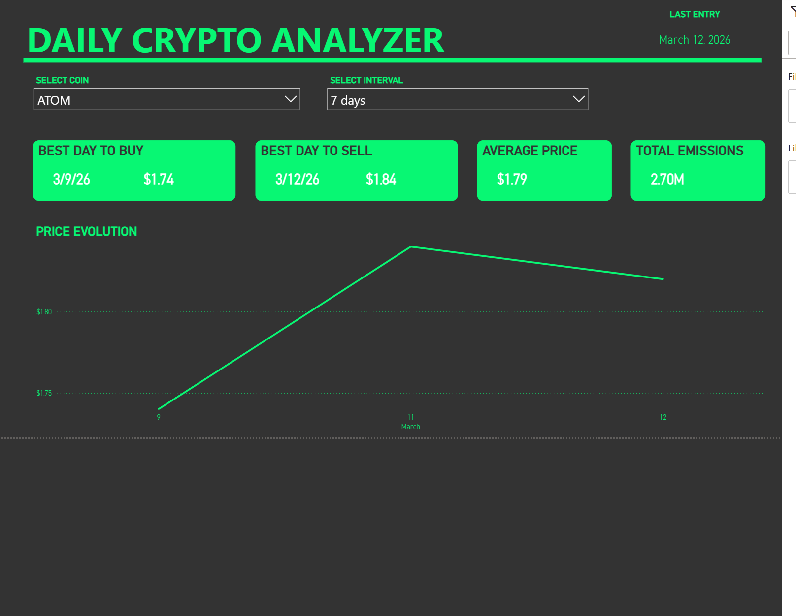

# 🚀 Crypto DataOps Pipeline: End-to-End Analytics Engineering


## 📌 Project Overview
This project is a fully automated **ELT (Extract, Load, Transform)** data pipeline that crosses financial cryptocurrency data with their respective Environmental, Social, and Governance (ESG) metrics (Energy Consumption and Carbon Footprint).

The goal is to provide a clean, tested, and modeled analytical database within a **Star Schema**, ready to be consumed by Business Intelligence tools to analyze the environmental impact of the crypto market. As part of this project, a Power BI dashboard was created:



## 🏗️ Architecture and Technologies

The project was designed following industry best practices (**Medallion Architecture** and **Infrastructure as Code**), utilizing a modern data stack:

* **Orchestration:** Apache Airflow (with Astronomer Cosmos)
* **Extraction & APIs:** Python (`requests`, `pandas`) extracting from the CoinGecko API and Carbon Ratings API.
* **Data Lake (Storage):** MinIO (S3-compatible) for raw file storage (JSON/CSV).
* **Data Warehouse:** PostgreSQL 17.
* **Transformation & Data Quality:** dbt (Data Build Tool).
* **Infrastructure:** Docker & Docker Compose.

---

## ⚙️ The Data Pipeline

The Airflow DAG is divided into 4 logical phases using `TaskGroups`:

1. **Extract (Data Lake):** * Daily API extraction with schema validation and secure storage in MinIO (S3).
   * Dynamic update of the active coin *Watchlist* via a MERGE operation (Type 1 SCD).
2. **Load (Postgres Raw):** * Efficient ingestion using `StringIO` and in-memory `COPY EXPERT` (Schema-on-Read), without creating intermediate physical files.
3. **Transform (dbt via Cosmos):** * Native orchestration of dbt `.sql` models directly within Airflow using the `astronomer-cosmos` library.
   * **Silver Layer (Staging):** Data cleaning, null value handling (e.g., converting `-1.0` from the API), and deduplication (`ROW_NUMBER()`).
   * **Gold Layer (Marts):** Creation of a high-performance Star Schema featuring `dim_crypto` and `fct_crypto_daily_metrics`.
   * **Data Quality Tests:** Rigorous testing for not-null values, uniqueness, Referential Integrity (Foreign Keys), and business rules.
4. **Serve (Export):** * Metadata-driven export process that dynamically discovers tables in the `gold` schema and generates `.csv` files ready for consumption in Power BI.

---

## 🌟 Technical Highlights

* **Idempotency:** The pipeline can be executed multiple times for the same date without duplicating data, ensuring historical integrity.
* **Granular Orchestration (Cosmos):** Transformation failures are isolated at the dbt model level, allowing for surgical re-runs and perfect visual dependencies.
* **Secrets Management:** Configuration of Connections (Postgres/MinIO) injected automatically at container startup via Environment Variables in `docker-compose.yml`.
* **Zero Hardcoding:** Extraction scripts read database tables in real-time to determine which coins to extract, creating a dynamic and self-sustaining loop.

---

## 🚀 How to Run Locally

**Prerequisites:** Docker and Docker Compose installed.

1. Clone this repository:
   ```bash
   git clone [https://github.com/vazmac/crypto-data-project.git](https://github.com/vazmac/crypto-data-project.git)
   cd crypto-data-project

2. Create a .env file in the root directory with your credentials and your CoinGecko API Key.

3. Start the infrastructure:
   ```bash
   make build
   make up

4. Access the Airflow UI at http://localhost:8080 (admin / admin).

5. Enable the crypto_daily_pipeline DAG.

---

## 📂 Repository Structure

```text
crypto_data_project/
├── dags/                           # DAGs and Orchestration Scripts (Airflow)
│   ├── crypto_daily_pipeline.py    # Main ELT and serving DAG
│   ├── scripts/                    # Extraction, loading, and serving scripts
│   │   ├── extract_coingecko_market_data.py   # CoinGecko data extraction
│   │   ├── extract_esg_data.py                # ESG/Carbon data extraction
│   │   ├── load_coingecko_market_data.py      # Load CoinGecko data into PostgreSQL
│   │   ├── load_esg_data.py                   # Load ESG data into PostgreSQL
│   │   ├── serve_data.py                      # CSV Export script
│   │   ├── __init__.py
│   │   └── __pycache__/
│   ├── __pycache__/                # Compiled Python cache
│   └── logs/                       # DAG execution logs
│
├── transform_crypto/               # dbt Project (Transformation & Data Quality)
│   ├── models/
│   │   ├── staging/                # Silver Layer (Cleaning and Deduplication)
│   │   │   ├── stg_crypto_prices.sql
│   │   │   └── stg_carbon_metrics.sql
│   │   └── marts/                  # Gold Layer (Star Schema Analytics)
│   │       ├── dim_crypto.sql      # Cryptocurrency Dimension
│   │       └── fct_crypto_daily_metrics.sql # Daily Facts
│   ├── macros/                     # Custom Jinja Macros
│   ├── tests/                      # Data Quality Tests
│   ├── seeds/                      # Static data (lookup tables)
│   ├── snapshots/                  # Change history (Type 2 SCD)
│   ├── dbt_project.yml             # dbt project configuration
│   ├── profiles.yml                # PostgreSQL connection profile
│   ├── logs/                       # dbt execution logs
│   └── README.md
│
├── scripts/                        # Initialization and Utility Scripts
│   └── init_db.sql                 # SQL script for schema and raw table creation
│
├── plugins/                        # Custom Airflow Plugins
│
├── dashboard/                      # Power BI Dashboard and CSV files exported by the pipeline
│
├── logs/                           # DAG logs (ignored in Git)
│   ├── dag_id=crypto_daily_pipeline/
│   ├── dag_id=extraction/
│   ├── dag_id=watchlist_load/
│   └── scheduler/
│
├── docker-compose.yml              # IaC Infrastructure (Postgres, MinIO, Airflow, PGAdmin)
├── Dockerfile                      # Custom Airflow Image
├── Makefile                        # Command Automation (build, up, down, logs, dbt)
├── requirements.txt                # Python Dependencies (Airflow, dbt, libs)
├── servers.json                    # Server Configuration (PGAdmin)
├── .gitignore                      # Ignored files for version control
└── README.md                       # Project Documentation